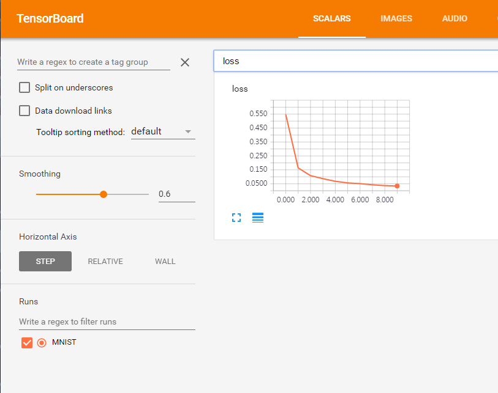

# Implemention LSTM example for MNIST data with Keras (Tensorflow backend)

### [Keras](https://github.com/fchollet/keras) is high-level neural networks API for Tensorflow, Theano.
### Dependencies: keras 2.0, tensorflow 1.0 (sudo pip install tensorflow, tensorflow-gpu(GPU only), keras)
#### Input: 28 rows of 28x1 fixel vector
#### Output: 10 classes
### Usage
#### Training: python mnist_lstm.py
#### Tensorboard: tensorboard --logdir=/tmp/keras/MNIST

'''shell
$ python mnist_lstm.py

Epoch 1/10
55000/55000 [==============================] - 27s - loss: 0.5893
Epoch 2/10
55000/55000 [==============================] - 27s - loss: 0.1655
Epoch 3/10
55000/55000 [==============================] - 27s - loss: 0.1101
Epoch 4/10
55000/55000 [==============================] - 26s - loss: 0.0847
Epoch 5/10
55000/55000 [==============================] - 27s - loss: 0.0668
Epoch 6/10
55000/55000 [==============================] - 27s - loss: 0.0562
Epoch 7/10
55000/55000 [==============================] - 28s - loss: 0.0459
Epoch 8/10
55000/55000 [==============================] - 28s - loss: 0.0421
Epoch 9/10
55000/55000 [==============================] - 26s - loss: 0.0364
Epoch 10/10
55000/55000 [==============================] - 27s - loss: 0.0318
Model saved in model/keras/lstm
training time: 280.585701942
predict time: 5.18135809898
accuracy:  98.5
'''

